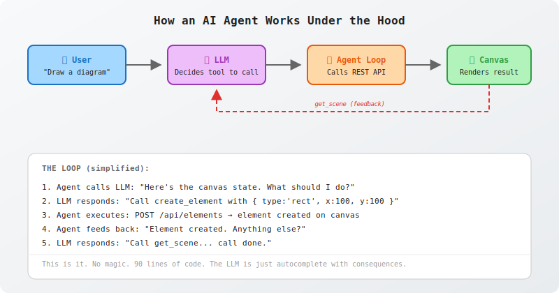

# Excalidraw Agent

A minimal AI agent that draws diagrams on an Excalidraw canvas — just an LLM, a REST API, and a loop.

> Based on [mcp_excalidraw](https://github.com/yctimlin/mcp_excalidraw) by yctimlin.
> The canvas server, element CRUD, and arrow binding logic are ported from that project — simplified, stripped of MCP/LangChain, and distilled to the core agent loop.



## Quick Start

```bash
# Install
npm install

# Start the canvas server
npm start

# In another terminal, run the agent
LLM_KEY=sk-your-key npm run agent -- "Draw a flowchart: user → login → dashboard"
```

Open `http://localhost:3000` to see the canvas in your browser.

The agent speaks to any OpenAI-compatible LLM (set `LLM_URL` and `LLM_MODEL` env vars to change endpoints), decides which tools to call, and executes them as HTTP requests to the canvas.

## Build

```bash
npm run build
```

Copies `src/` to `dist/` for production deployment.

## Deploy

### Docker

```bash
# Build the image
docker build -t excalidraw-agent .

# Run
docker run -d -p 3000:3000 excalidraw-agent

# Or use docker-compose
docker compose up -d
```

### VPS deployment (via Makefile)

```bash
# 1. Create .env with:
#    HOST=your.vps.ip
#    VPS_USER=root
#    VPS_PATH=/opt/excalidraw-agent

# 2. Initial config
make init-config

# 3. Build and deploy
make deploy
```

### GitHub Container Registry

```bash
# Login
echo $GITHUB_TOKEN | docker login ghcr.io -u mikhail-angelov --password-stdin

# Build and push
make push

# On VPS: update .env and docker-compose, then:
docker compose pull && docker compose up -d
```

## Project Structure

```
├── src/
│   ├── server.js      # Express canvas server (REST + WebSocket)
│   └── agent.js       # AI agent loop (~90 lines)
├── agent-loop.svg     # Architecture diagram
├── Dockerfile         # Multi-stage production build
├── docker-compose.yml # Deployment config
├── Makefile           # Build & deploy commands
└── package.json       # Dependencies & scripts
```

## Environment Variables

| Variable | Default | Description |
|----------|---------|-------------|
| `PORT` | `3000` | Canvas server port |
| `HOST` | `localhost` | Canvas server host |
| `LLM_URL` | `https://api.openai.com/v1/chat/completions` | LLM API endpoint |
| `LLM_KEY` | `$OPENAI_API_KEY` | LLM API key |
| `LLM_MODEL` | `gpt-4o` | LLM model name |

## How It Works

1. **Canvas server** (`src/server.js`): Express + WebSocket. Stores Excalidraw elements in memory. REST API for CRUD. WebSocket pushes updates to connected browsers.

2. **Agent** (`src/agent.js`): Pure loop — calls LLM, LLM responds with tool calls, agent executes them as HTTP requests, feeds results back, repeats until done. No MCP, no LangChain, no frameworks.

3. **Arrow binding**: When the agent creates arrows with `startElementId`/`endElementId`, the server resolves them to `start`/`end` coordinates so the canvas renders correctly.

## License

MIT
